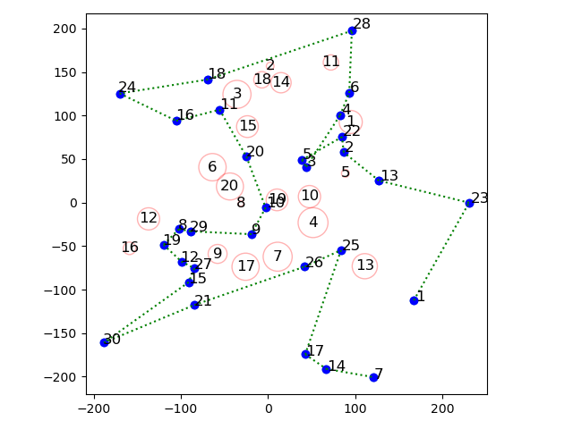

# Traveling Salesman Problem (With Blocked Paths)
This project is made for Bilkent University - IE400 Principles of Engineering Management course.

## About the problem
In this project, we were given the Cartesian coordinates of 30 locations (first sheet of
data.xlsx) and the storm regions defined by the center and radius of the storm (second
sheet of data.xlsx). The type of the road between any of the two locations are also provided
(the third sheet of data.xlsx).

A cargo truck has to visit 30 locations on an island to deliver cargoes. There is only a single
two-way road to travel from any of these two locations. These roads have no turning points
_i.e. they are linear_. 

Suppose that the locations are on a tropical island where regional storms
occur in circular shapes and surround certain regions of the island. If some part of the road is
surrounded by the storm, the cargo truck **can not** choose that road.

The cargo truck moves with a constant speed along the road. There are three types of roads on this island: asphalt, concrete and
gravel. Speed of the truck differs based on the road type:

| Road Types  | Speeds |
| ------------- | ------------- |
| Asphalt  | 100 unit/hour  |
| Concrete  | 65 unit/hour  |
| Gravel  | 35 unit/hour  |

The aim is to visit all locations from a starting point and then turn back to its initial pozition while **minimizing the traveling time.**

## Contents
_ie_project_final.py_ contains the necessary script to initialize the problem and minimize the time cost.

_plot.py_ contains the necessary script to plot the destinations, storms and the optimum route taken by the vehicle.

_data.xlsx_ is provided by the instructor and it contains the information to solve the problem.

## Example Result
The cargo begins from the first point given in the problem data.

Blue dots represent the locations the cargo has to visit. Red circles represent the 'storms' that are to be avoided by the cargo truck. Green dotted line represents the optimum route taken by the cargo truck. 

